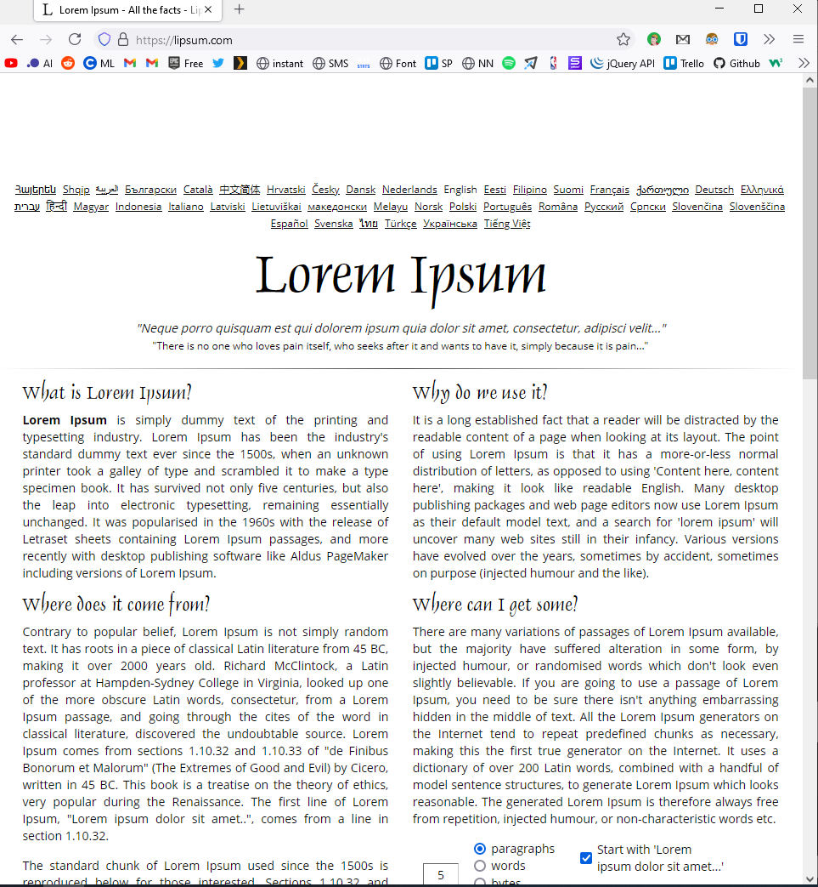
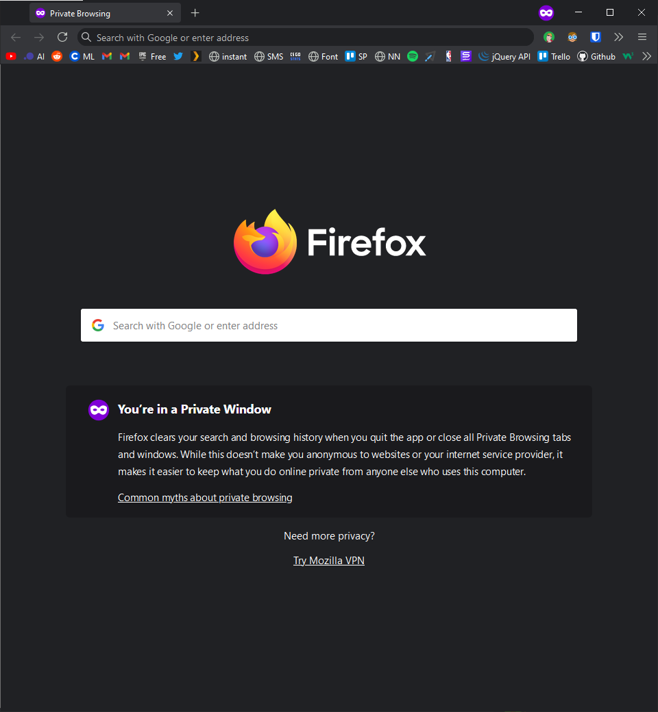

# firefox-private-browsing-custom-theme
My personal attempt at making Firefox look like Google Chrome, after using Chrome as my main browser since 2009.

# Installation
Follow the instructions from [this reddit post](https://reddit.com/r/FirefoxCSS/comments/73dvty/tutorial_how_to_create_and_livedebug_userchromecss/).

# Screenshots
## Normal Browsing Mode

## Private Browsing Mode

